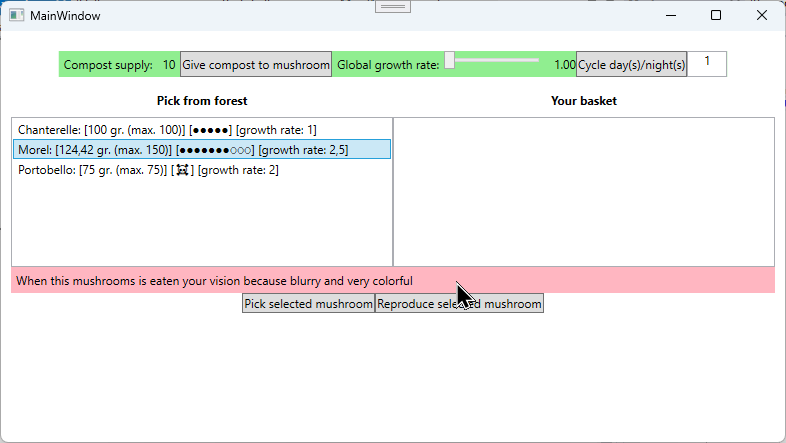

# Examen PRA 2024-2025 JH2 - Mushrooms

## Algemene omschrijving

In deze examenopdracht maak je een applicatie waar paddenstoelen kunnen groeien in het bos. Paddenstoelen hebben elk hun eigen eigenschappen: de ene kan bijvoorbeeld al wat groter of zwaarder worden dan de andere.

Gedurende dag/nacht groeien de paddenstoelen en worden ze groter, maar let op, want wanneer een paddenstoel te groot wordt, gaat ze dood.

Paddenstoelen kunnen geplukt worden. Plukken betekent dat je ze  uit het bos haalt en in je plukmandje plaatst.

Gezien het eten van paddenstoelen toch enig risico met zich mee breng willen we de gebruiker goed informeren. Mocht een paddenstoel hallucinogene effecten hebben, dan zullen we gebruiker daarvan op de hoogte stellen.

Tot slot moet een paddenstoel zich ook kunnen voortplanten in het bos. Nieuwe paddenstoelen beginnen dan te groeien!

## Opdracht 1: Het bos vullen met paddenstoelen (5 pt)
**Hieronder zie je alvast een screenshot van hoe de applicatie er uit ziet na opdracht 1.**

> De paddenstoelen hebben hun standaardgewicht en zijn nog niet gegroeid. De bolletjes duiden aan hoe groot de `Mushroom` maximaal kan worden (`MaxSize`, 1 bolletjes = 1 cm). De `CurrentSize` van de paddenstoel kleurt de bolletjes zwart (zie ook andere screenshots):


### 1a: Superklasse aanmaken in .Core bibliotheek
1. Voorzie een aparte `.Core` klassenbibliotheek die je gebruikt in je WPF-applicatie.
2. Maak een folder 'Entitities' in het .Core project.
3. Maak in de `Entities` folder een klasse `Mushroom` aan. Het moet onmogelijk zijn om een instantie van een mushroom aan te maken.

Deze code hoort dus niet te werken:
```
❌ Mushroom mushroom = new Mushroom(...);
```

4. Een mushroom heeft de volgende properties:

| Property | Type | Omschrijving | Vereisten |
|----------|------|--------------|-----------|
|`Name` | string  | De naam van de paddenstoel (bv. "Stinkzwam")| Enkel aanpasbaar vanuit de klasse of een subklasse. |
|`IsAlive`| bool  | Of de paddenstoel leeft| Aanpasbaar van buiten de klasse. Default value = true. |
|`IsPoisonous`| bool | Of de paddenstoel giftig is of niet | Enkel aanpasbaar vanuit de klasse of een subklasse. |
|`CurrentSize`| double | Hoe groot de paddenstoel momenteel is (in cm) |Enkel aanpasbaar vanuit de klasse of een subklasse. Moet minstens 0 zijn, zoniet wordt een `ArgumentException` opgegooid |
|`MaxSize`| double | Hoe groot de paddenstoel maximaal kan worden (in cm) | Moet minstens 1 cm groot zijn, zoniet wordt een `ArgumentException` opgegooid. Enkel aanpasbaar binnen de klasse `Mushroom`. |
|`CurrentWeight`| double | Hoeveel de paddenstoel momenteel weegt (voorstelling in gram) | Enkel aanpasbaar vanuit de klasse of een subklasse. Moet minstens 0 zijn, zoniet wordt een `ArgumentException` opgegooid |
|`MaxWeight`| double | Hoeveel de paddenstoel maximaal kan wegen (voorstelling in gram) | Enkel aanpasbaar binnen de klasse `Mushroom`. Moet minstens 1 gram zijn, zoniet wordt een `ArgumentException` opgegooid. Enkel aanpasbaar binnen de klasse `Mushroom`. |
|`GrowthRate`| double | het aantal cm dat de paddenstoel per nacht groeit | Enkel aanpasbaar vanuit de klasse of een subklasse. Default value = 1 |

5. We willen toelaten om mushrooms te initialiseren op verschillende manieren. Voorzie de volgende constructors met argumenten:
    1. (name)
    2. (name, maxWeight)
    3. (name, maxWeight, maxSize)
    4. (name, maxWeight, maxSize, isPoisonous)

> Optimaliseer je constructors!

## 1b: Subklassen
1. Maak nu 3 concrete paddenstoelen (klasses) aan: Morel, Portobello en Chanterelle.

2. Zorg ervoor dat deze paddenstoelen aangemaakt kunnen worden als volgt:

````
 ✅ new Morel();
 ✅ new Chanterelle();
 ✅ new Portobello();
 ````

De specifieke eigenschappen van de paddenstoelen dienen voor deze uitwerking binnen de klasses definieërd te worden. Stel het volgende in:

| Klasse    | Naam (van de paddenstoel) | maxWeight | maxSize | isPoisonous | GrowthRate | CurrentWeight |
|-----------|---------------------------|-----------|---------|-------------| ---------- |--------------|
|Portobello | Portobello                | 75 (gr)  | 7 (cm)  | nee         | 2  |     standaard |
|Chanterelle| Chanterelle               | 100 (gr)  | 5 (cm)  | ja          | standaard       | standaard |
|Morel      | Morel                     | 150 (gr)  | 10 (cm) | nee         | 0.5          | 50 (gr) |


## 1c: Bos aanmaken (Forest klasse)
Maak in het `.Core` project een nieuwe map aan met de naam `Services`. Plaats hierin een klasse `Forest` (of `ForestService` indien je dit wenst). Deze klasse zal de paddenstoelen beheren. Voorzie hiervoor het volgende:

* Een **read-only** property met de naam `Mushrooms`. Het type van deze property is een `List<Mushroom>`. **Deze lijst bevat alle paddenstoelen die in het bos staan.**
* Zorg ervoor dat de lijst enkel en alleen aangepast kan worden binnen het `Forest`.
* Een constructor die een `bool` als argument ontvangt. Indien het argument `true` is, dan zorg je ervoor dat er data geseed (toegevoegd) wordt. Zorg ervoor dat je van elke soort paddenstoel minstens 1 exemplaar in het bos plant.
* Een methode `Plant`, return type `void`. Voegt een `Mushroom` toe dat meegegeven werd als argument aan de paddenstoelen in het bos.
* Een methode `Pick`, return type `bool`. Verwijdert een `Mushroom` dat meegegeven werd als argument en retourneert `true` wanneer het verwijderen succesvol was. `False` indien niet.

> Ter info: via de read-only property `Mushrooms` kan je straks achterhalen welke mushrooms er allemaal in het bos staan.

## 1d: Paddenstoelen in het bos weergeven

1. Instantieer in de WPF-applicatie een nieuw `Forest` mét data.
2. Geef alle paddenstoelen in het bos weer in `lstForest`.
3. Overschrijf in de `Mushroom` de `ToString` method om de naam van de paddenstoel weer te geven. Gebruik het patroon zoals te zien in de screenshots. Je kan deze bolletjes gebruiken: ◌ en ●.


# Opdracht 2: Paddenstoelen laten groeien (4 pt)
**Hieronder zie je alvast een screenshot van hoe de applicatie er uit ziet na opdracht 2.**

> SCREENSHOT 1 - Na 1 nacht

> De Chantarelle groeide 1 cm, de Portobello 2 cm (bolletjes). De Morel groeide een halve centimeter. Gezien we enkel per centimeter tonen is dit nog niet zichtbaar in de UI.


> SCREENSHOT 2 - Nog 1 nacht later

> De Chantarelle groeide nu tot 2 cm, de Portobello 4 cm (bolletjes). De Morel groeide weer een halve centimeter bij en is nu 1 cm. De UI toont nu wel hoe groot ie is.


## 2a: Basisimplementatie groeien
Elke paddenstoel kan groeien. Voorzie hiervoor een methode `Grow` met als return type `void` op de gepaste plaats. Deze methode ontvangt een `int` met het aantal nachten dat de paddenstoel groeit.

De groeiregels zijn als volgt:
* Enkel levende paddenstoelen kunnen groeien.

* Een paddenstoel groeit per nacht. Gebruik deze formule om de groeihoeveelheid van de paddenstoel te bepalen:

```
groeihoeveelheid = aantal nachten * growthrate van de paddenstoel

// bv.: 
// 1 nachten groeien * groeisnelheid van 2 = 2 cm groeien (op 1 nacht)
// 4 nachten groeien * groeisnelheid van 0.5 = 2 cm groeien (op 1 nacht)
```

* Een paddenstoel kan maximaal zijn `MaxSize` bereiken. Indien hij tijdens het groeien over zijn `MaxSize` probeert te groeien, sterft hij af (`IsAlive` = false) en wordt zijn `CurrentSize` gelijk aan zijn `MaxSize`.
    
* Het gewicht van de paddenstoel neemt met 10 % toe per nacht en kan nooit zwaarder worden dan zijn maximale gewicht. Dat bereken je als volgt:

```
nieuw gewicht (na 1 nacht!) = huidig gewicht + ( huidig gewicht / 10 )
```
* Paddenstoelen die starten met een gewicht van 0 gram, verzwaren deze tijdens de eerste nacht 50 gram. Vanaf de tweede nacht verzwaren ze 10 % per nacht.

Zorg ervoor dat na het klikken op `btnCycleDays` de input uit `txtNumberOfDays` uitgelezen wordt en dat **alle paddenstoelen in het bos (`Forest`) groeien** voor het gevraagde aantal dagen.

De updates zijn onmiddellijk zichtbaar op de UI. Zorg ervoor dat de gebruiker steeds op de hoogte is van de huidige status van de paddenstoel. Indien hij stierf, geef je dit ook duidelijk weer (☠️).

## 2b: Specifieke groeicondities voor de Morel
Op dit moment groeien alle paddenstoelen op dezelfde manier (nl. met de logica die je schreef in de vorige stap).

Echter, bij de `Morel` gebeurt er iets bijzonders! Naarmate de paddenstoel groeit, begint hij sneller en sneller te groeien. Concreet: elke groeicyclus dient deze paddenstoel `0.5` (cm) meer te groeien en dat met een **maximale groeisnelheid van 2.5**.

# Opdracht 3: Hallucinogene paddenstoelen (3 pt)
**Hieronder zie je alvast een screenshot van hoe de applicatie er uit ziet na opdracht 3.**

> SCREENSHOT 1 - De paddenstoel is te klein en heeft nog geen hallucinogene effecten:


> SCREENSHOT 2 - De paddenstoel is te groot geworden en kreeg hallucinogene effecten:



1. Maak in het `.Core` project een nieuwe folder met de naam `Interfaces`.
2. Maak in deze map een interface met de naam `IHallucinogenic`.

Deze interface hoort het volgende af te dwingen:
* een **read-only property** van het type `bool` met de naam `HasHallucinogenicEffect`. Deze property vertelt of de paddenstoel (al) hallucinogene effecten heeft.
* een methode die een `string` retourneert met de naam `GetEffectDescription`. Deze string vertelt wat het effect is van de hallucinogene paddenstoel.

Enkel de `Morel` dient hallucinogeen te worden. Dat gebeurt onder de volgende voorwaarden:
* Wanneer de paddenstoel groter is dan 3 cm, wordt hij hallucinogeen (lees: heeft hij `HasHallucinogenicEffect`). Kleinere morels hebben nog geen effect.
* De effect description is de volgende: "When this mushroom is eaten your vision becomes blurry and very colorful".

Wanneer een gebruiker een dergelijke paddenstoel in het bos selecteert, dan wordt hij/zij hiervan op de hoogte gebracht met een 'warning' door de hallucinogene effecten (verkregen uit `GetEffectDescription()`) te tonen in het label `lblHallucinogenicEffects`. Dit label mag **uitsluitend** gebruikt worden voor hallucinogene paddenstoelen.

# Opdracht 4: Paddenstoelen plukken (2 pt)
**Hieronder zie je alvast een screenshot van hoe de applicatie er uit ziet na opdracht 4.**

> SCREENSHOT 1 - het plukken lukt:


> SCREENSHOT 2 - het plukken faalt:


## 4a: Checken of een paddenstoel geplukt kan worden
**Elke** `Mushroom` kan geplukt worden op voorwaarde dat hij nog leeft (`IsAlive`) en minstens een beetje heeft gegroeid (`CurrentSize` groter dan `0`). Voorzie hiervoor een methode met de naam `IsReadyToPick()` op de gepaste plaats. Deze methode retourneert een `bool` die aangeeft of de paddenstoel klaar is om te plukken.

* Bij een `Morel` zijn de condities anders: ze moet **bovendien** minstens 75 gram wegen.

* Een `Portobello` moet **bovendien** minstens 5 cm zijn om te kunnen plukken.

* Bij een `Chanterelle` zijn er geen geen extra eisen.

Wanneer de paddenstoel niet geplukt dan worden, geef je een melding aan de gebruiker.

## 4b: Effectief plukken
Werk nu ook een plukfunctionaliteit uit. Je kan in het bos selecteren welke paddenstoel je wil plukken (`lstForest`). Gebruik hiervoor de `Pick` methode van het `Forest` die je eerder schreef.  

Wanneer een paddenstoel geplukt wordt, wordt ze uit het bos verwijderd aan je plukmandje toevoegd. Maak voor dit plukmandje een nieuwe klasse `Basket` (of `BasketService`) aan in de `Services` folder. Deze `Basket` houdt (net zoals de `Forest`) een `List<Mushroom>` bij en bevat een `Add` methode die eender welke `Mushroom` kan ontvangen en toevoegen.

Denk er echter aan dat een paddenstoel niet zomaar geplukt kan worden (cfr. `IsReadyToPick()`). Enkel paddenstoelen die geplukt kunnen worden worden toegevoegd aan de mand.

Er kunnen **maximaal 2 paddenstoelen in je mandje geplaatst worden**. Schrijf hiervoor de nodige logica. Mocht er een 6de paddenstoel in de mand geplaatst worden, dan gooi je een `Exception` op die je afhandelt op de UI.

> Denk er ook aan dat een paddenstoel die geplukt wordt niet meer in het bos staat. Na het plukken wordt deze dus sowieso verwijderd ook wanneer het niet in het mandje past!

# Opdracht 5: Voortplanten paddenstoelen (2 pt)
**Hieronder zie je alvast een screenshot van hoe de applicatie er uit ziet na opdracht 5.**

> SCREENSHOT 1 - het voortplanten lukt (een nieuwe 'baby' Morel werd toegevoegd met default waardes):


> SCREENSHOT 2 - het voortplanten faalt:


Voorzie logica om paddenstoelen zich te laten voortplanten door een interface aan te maken met de naam `IReproduceable` in de `Interfaces` folder. De interface dient de volgende methode af te dwingen:

```
Mushroom Reproduce();
```

Elke paddenstoel in de applicatie hoort zich te kunnen voortplanten, behalve `Chanterelle`. Zorg ervoor dat, na het klikken op de knop `btnReproduce`, de geselecteerde paddenstoel zich voortplant. Voortplanten betekent dat er een **nieuwe** paddenstoel van **dezelfde soort** toevoegt aan het `Forest` als de geselecteerde paddenstoel. Gebruik hiervoor de `Reproduce()` methode van de `Mushroom` en de `Plant()` methode van het `Forest`.

# Opdracht 6: Vragen (2 pt)

Beantwoord de volgende vragen (geef antwoord in deze README):

* Vraag 1: Geef aan hoe de bestaande code voor meer losse koppeling kan zorgen. Wat zou je met andere woorden aanpassen?
```
Antwoord vraag 1 tussen de backticks.
```

* Vraag 2: Je wil functionaliteit toevoegen om een paddenstoel te doen rotten. Hoe zou jij dit aanpakken (vertel, je hoeft geen code te schrijven!)
```
Antwoord vraag 2 tussen de backticks.
```

* Vraag 3: In de huidige codebase wordt een methode gebruikt voor `IsReadyToPick()`. Stel een alternatieve aanpak voor.
```
Antwoord vraag 3 tussen de backticks.
```

# Opdracht 7 (extra time): De 'Global Growth Rate' instellen (1 pt)
**Hieronder zie je alvast een screenshot van hoe de applicatie er uit ziet na opdracht 7.**

> De paddenstoelen groeiden maar 1 nacht, terwijl de `GlobalGrowthRate` 3 was. De `Chanterelle` groeide bijgevolg 3 (ipv 1) cm.


Maak in je klassenbibliotheek in de map `Entities` een klasse `World` aan met exact volgende inhoud:
```c#
namespace Pra.Exam.Core.Entities
{
    public static class World
    {
        private static double globalGrowthRate = 1;
        public static double GlobalGrowthRate
        {
            get { return globalGrowthRate; }
            set
            {
                if (value <= 0) throw new ArgumentException("Growth rate must be positive.");
                globalGrowthRate = value;
            }
        }
    }
}
```

De klasse `World` heeft een property `GlobalGrowthRate`. 
Afhankelijk van het klimaat zullen **alle** paddenstoelen namelijk sneller of trager groeien.
Hou er nu ook rekening mee dat, afhankelijk van het klimaat, de paddenstoelen sneller of trager beginnen groeien door gebruik te maken van deze property op een gepaste plaats.

De `GlobalGrowthRate` kan je wijzigen door de slider `slrGlobalGrowthRate` te wijzigen.
De waarde van de slider lees je als volgt uit:
```
double sliderValue = slrGlobalGrowthRate.Value;
```
# Opdracht 8 (extra time): Compost aan een paddenstoel geven (1 pt)

Voorzie een eigen implementatie voor het volgende:

* Zorg ervoor dat je een paddenstoel compost kan geven.
* De applicatie (WPF) start op met 10 composteenheden (zie code behind). Dit is het maximale aantal compost dat uitgedeeld kan worden aan een de paddenstoelen.
* Een paddenstoel gebruikt 10% van de beschikbare compost op.
* Bij het groeien wordt nu ook rekenening gehouden met de compost die de plant heeft.
